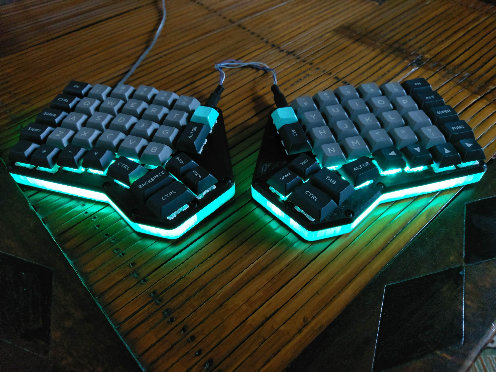

**34 keys is all you need**: 
A mechanical keyboard journey

<!-- HTML comment recognizes as a presenter note per pages. -->
<!-- You may place multiple comments in a single page. -->

<!-- _footer: Mattia Dal Ben -->

---

####  Who am I?

- Master degree in EE
- Working as SWE @ Eurotech
- Designed few popular keyboard designs: Redox, Redox Wireless, Yampad

---

### What is this talk about?

* We're not gonna talk about your average custom mechanical keyboard
* We're gonna talk about small from factor (sub 40%), ergonomic, low profile (choc), open-source(mostly), mechanical keyboards
* We're gonna talk about what firmware/software features/techniques make them a viable option (features that can be applied even to normal keyboards)
* ... and, above all, **why** should you want to try them.

---
